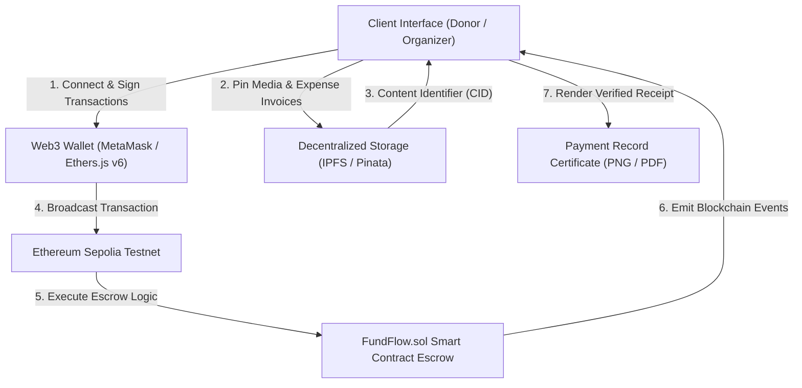

# FundFlow: Blockchain-Based Transparent Charity Donation System

> **Academic Mini Project**  
> **Course:** Blockchain Technology (BCT)  
> **Affiliation:** Savitribai Phule Pune University (SPPU) — Department of Computer Engineering / Information Technology  

---

## 1. Abstract & Problem Statement

Traditional charitable donation mechanisms depend on centralized intermediaries, exposing donors to opaque financial management, 7% to 15% administrative overhead, and zero visibility into how disbursements are spent. 

**FundFlow** is a decentralized application (dApp) developed as an academic mini project for the **SPPU Blockchain Technology (BCT)** curriculum. It leverages the Ethereum blockchain to eliminate intermediary take-rates and restore radical transparency. Donations are locked in an audited, non-reentrant smart contract escrow on Ethereum Sepolia, providing real-time INR/ETH conversion tracking, cryptographic milestone-based disbursement proofs anchored on IPFS, verifiable instant Payment Records, and immutable on-chain audit trails.

---

## 2. BCT Concepts Used

| Blockchain Concept | Theoretical Principle | Implementation in FundFlow |
| :--- | :--- | :--- |
| **Distributed Ledger & Immutability** | Cryptographic state persistence without central authorities | Every contribution, withdrawal event, and balance query is permanently etched on the Ethereum Sepolia ledger. |
| **EVM State Machine & Gas Optimization** | Deterministic byte-code execution and gas-efficient state mutators | Optimized Solidity storage layouts (`struct`, `mapping`, packed enums), reducing gas consumption per donation and withdrawal transaction. |
| **Smart Contract Escrow & Access Control** | Self-executing code with role-based cryptographic permissions | `FundFlow.sol` enforces that only the registered cause creator (`onlyOrganizer`) can withdraw escrowed capital upon logging expenditure reasons. |
| **Decentralized Storage (IPFS)** | Content-addressed storage offloading large media from on-chain state | Campaign banners and withdrawal invoice proofs are pinned via IPFS CID hashes, linking immutable media directly with smart contract transactions. |
| **Smart Contract Security Patterns** | Preventing reentrancy and arithmetic anomalies | Strict adherence to the `Checks-Effects-Interactions` pattern coupled with custom mutex reentrancy locks and native Solidity `^0.8.20` overflow safeguards. |
| **Web3 Client Engineering (EIP-1193)** | Asynchronous browser wallet handshakes and cryptographic transaction signing | Full-stack integration using React, Ethers.js v6, responsive mobile drawer navigation, and instant client-side Payment Record generation. |

---

## 3. System Architecture & Data Flow



---

## 4. Smart Contract Architecture (`FundFlow.sol`)

### 4.1 Data Structures
```solidity
enum Category { Medical, Education, Disaster, Food, Community }

struct Donation {
    address donor;
    uint256 amount;
    uint256 timestamp;
}

struct Withdrawal {
    uint256 amount;
    string purpose;
    string receiptIpfsHash; // Off-chain proof of expenditure on IPFS
    uint256 timestamp;
}

struct Campaign {
    uint256 id;
    address payable organizer;
    string title;
    string description;
    string imageIpfsHash;
    Category category;
    uint256 targetAmount;
    uint256 amountCollected;
    uint256 amountWithdrawn;
    uint256 deadline;
    bool isActive;
    bool exists;
}
```

### 4.2 Key Contract Functions
- `createCampaign(...)`: Registers a new verified humanitarian cause with an Ethereum funding target, deadline, and IPFS metadata hash.
- `donate(uint256 _campaignId)`: *Payable* function accepting ETH, transferring funds into contract escrow, updating donor history, and emitting a `Donated` event.
- `withdrawFunds(uint256 _campaignId, uint256 _amount, string memory _purpose, string memory _receiptIpfsHash)`: Allows verified campaign organizers to execute milestone releases only after attaching an expenditure justification and IPFS invoice CID.
- `getPlatformOverview()`: Read-only view returning real-time aggregated metrics (total capital escrowed, total donations, verified initiatives count).

---

## 5. Security & Academic Best Practices

1. **Reentrancy Immunity:** State updates occur strictly before external value transfers (`Checks-Effects-Interactions` pattern), fortified by a mutex lock preventing recursive draining attacks.
2. **Cryptographic Access Control:** Milestone withdrawals and campaign status toggles strictly verify `msg.sender == campaign.organizer`.
3. **Escrow Solvency Invariant:** Contract guarantees mathematically that cumulative withdrawals never exceed `amountCollected - amountWithdrawn`.
4. **Decentralized Auditability:** Expenditure invoices are permanently anchored to IPFS and linked directly to Ethereum transaction hashes.
5. **Zero Middleman Take-Rate:** 100% of contributed capital delivers directly to beneficiary escrow with zero platform commission deductions.

---

## 6. Live Testnet Deployment

| Parameter | Value |
| :--- | :--- |
| **Network** | Ethereum Sepolia Testnet (Chain ID: `11155111`) |
| **Contract Address** | `0x376a819Cf9e7dFAb537aE00e1063A9A17f63c497` |
| **Block Explorer** | [View on Sepolia Etherscan](https://sepolia.etherscan.io/address/0x376a819Cf9e7dFAb537aE00e1063A9A17f63c497) |
| **Solidity Compiler** | `0.8.20` (Optimization: 200 runs, EVM: Paris) |
| **Frontend Production URL** | Deployed on Vercel with automatic continuous integration |

---

## 7. Setup & Execution Guide

### Prerequisites
- Node.js (v18+ or v20+)
- MetaMask browser extension configured for the Sepolia network

### 7.1 Smart Contract Compilation & Automated Tests
```bash
# Install root dependencies
npm install

# Run automated Hardhat test suite (12 unit tests)
npx hardhat test

# Deploy to Sepolia testnet
npx hardhat run scripts/deploy.js --network sepolia
```

### 7.2 Running the Frontend dApp
```bash
# Navigate to frontend and install dependencies
cd frontend
npm install

# Start local development server
npm run dev
```
Open [http://localhost:3000](http://localhost:3000) to interact with the live platform.

---

## 8. Learning Outcomes (SPPU BCT)

Through the implementation of FundFlow, the following academic learning objectives were accomplished:
- Practical understanding of EVM state management, gas optimization, and Solidity smart contract development.
- Hands-on implementation of non-reentrant escrow contracts with multi-party access control.
- Integration of decentralized storage (IPFS) with on-chain cryptographic transaction events.
- End-to-end dApp development integrating frontend Web3 providers (Ethers.js v6) with mobile-responsive UI components.
- Implementation of cryptographic verification receipts with client-side image rendering and social sharing integrations.
- Security auditing against reentrancy, unauthorized withdrawals, and integer state mutations.

---
*Submitted as an academic mini project for the Blockchain Technology (BCT) laboratory curriculum, Savitribai Phule Pune University (SPPU).*
